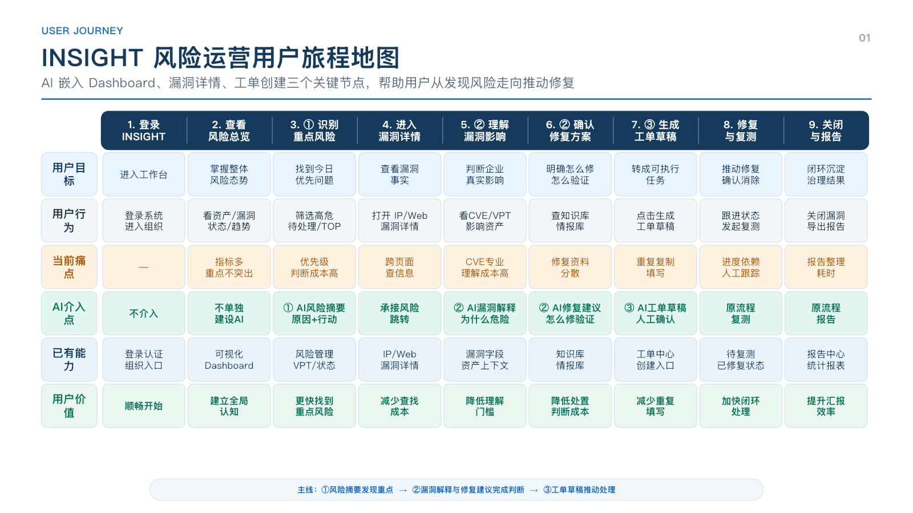
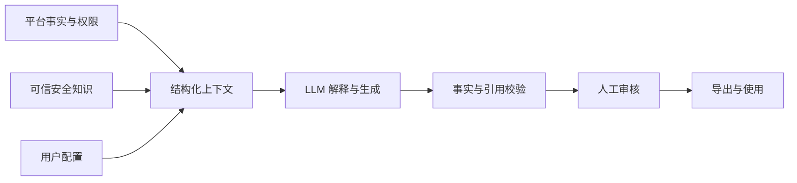
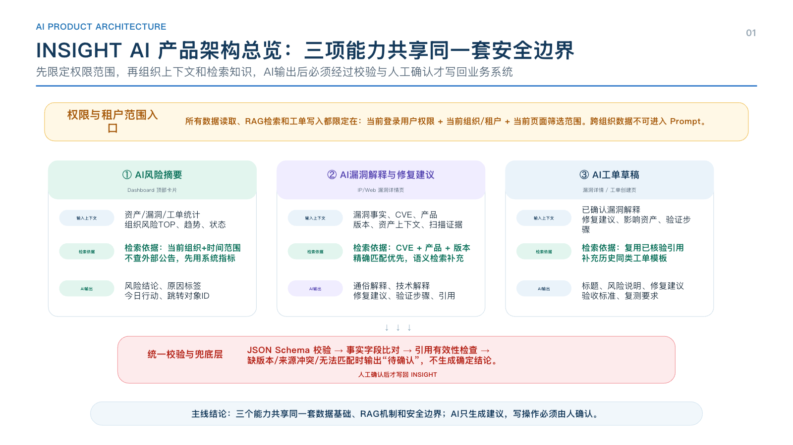
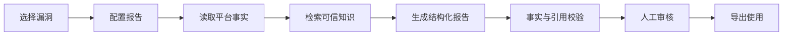

# B 端 AI 安全产品作品集

> 企业级漏洞运营场景的 AI 产品方案与概念验证（公开脱敏版）

这是我在 AI 产品经理实习期间完成的一组阶段性成果。项目围绕安全运营人员“发现漏洞—分析影响—形成报告—推动处置”的工作链路，完成了从业务研究、场景选择、产品方案、PRD、可交互 Demo 到 Roadmap 的完整概念验证。

本仓库只包含适合公开展示的脱敏材料。INSIGHT 作为原型项目名称保留；所有资产、IP、组织、人员和业务数据均为模拟数据。内容不代表正式产品能力，也不包含客户数据、内部账号、服务器配置或 Mentor 提供的原始材料。

## 一分钟了解项目

- **目标用户：** 企业安全运营人员、安全负责人和修复人员
- **核心问题：** 信息分散、研判链路长、报告质量不一致
- **一期场景：** AI 漏洞分析报告
- **选择原因：** 痛点明确、数据基础较好、模型能力匹配、错误风险可通过人工审核控制
- **个人职责：** 业务与竞品研究、AI 场景分析、用户流程、Agent 流程、PRD、交互原型、Demo 验证和 Roadmap
- **项目阶段：** 产品方案与 PoC，未接入真实生产数据

## 关键产品判断

我没有优先选择开放式聊天机器人，因为它的任务边界和效果标准不够清晰；也没有直接选择自动处置，因为补丁安装、状态修改等操作的错误成本较高。报告生成既能复用平台事实和可信知识，又能保留人工审核，因此更适合作为一期可验证的切入点。

AI 与系统的分工是：

- 平台负责 CVE、资产、组织、状态等确定性事实；
- 检索层提供带来源的动态知识；
- 大模型负责解释、归纳和结构化表达；
- 信息不足或来源冲突时输出“待确认”；
- 高风险结论必须可追溯，并由人最终确认。

## 作品导航

| 阶段 | 展示内容 | 入口 |
|---|---|---|
| 01 | 业务与竞品研究方法、场景筛选框架 | [研究摘要](./01-research/README.md) |
| 02 | AI 安全运营落地方案、用户旅程与能力架构 | [方案 HTML](./02-solution/index.html) |
| 03 | AI 漏洞分析报告 PRD V2.0 | [PRD HTML](./03-prd/index.html) |
| 04 | 可点击 HTML Demo | [Demo](./04-demo/index.html) |
| 05 | 12 周产品 Roadmap、RICE 与验收门槛 | [Roadmap HTML](./05-roadmap/index.html) · [规划工作簿](./05-roadmap/rice-and-gantt.xlsx) |
| 复盘 | 完整项目背景、取舍和验证结论 | [Case Study](./CASE_STUDY.md) |

## 核心流程

## Demo 迭代

项目过程中保留了 3 个可核验的关键版本：7 月 9 日的初版概念原型、7 月 16 日用于 Mentor 评审的报告 Demo，以及 7 月 23 日结合反馈形成的最终交互版本。迭代不只调整视觉，还重点优化了任务入口、信息层级、生成过程可解释性、待确认项和人工审核机制。

## 本地查看

直接打开各目录中的 `index.html` 即可浏览。Demo 为纯 HTML、CSS 和 JavaScript，不需要安装依赖，也不会访问外部服务。

若使用 GitHub Pages，可在仓库设置中选择从默认分支根目录发布；发布后将 `04-demo/` 路径作为面试演示入口。具体步骤见 [发布检查清单](./PUBLICATION_CHECKLIST.md)。

## 声明

本项目用于展示产品思考与原型验证能力。页面中的模型能力、指标和流程均为产品方案或目标口径，不代表已经生产上线或取得真实业务效果。
